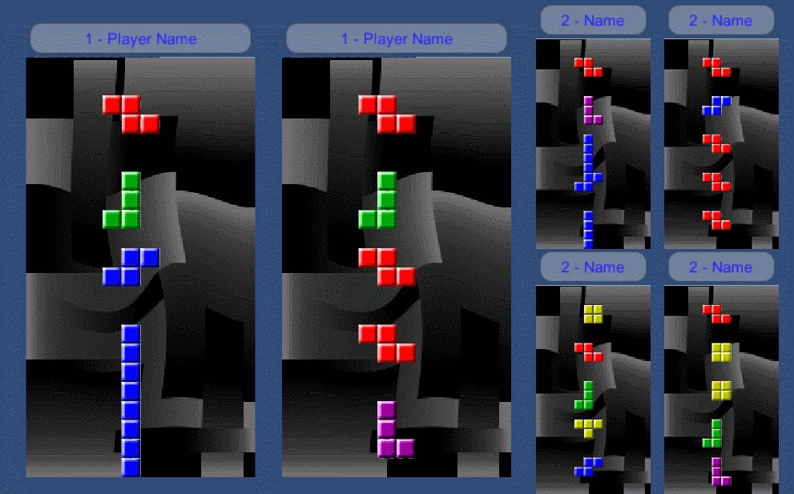

# TetriNET-RL
Yet another clone of TetriNET, the 1997 Tetris game by St0rmCat, written in Unity

## Status
Alpha. Core Tetris is playable in a test scene but that's it. Ugly main menu. Work In Progress.

## Planned Features
* Cross-platform (Android. WebGL, Linux, Mac, Windows, maybe more)
* Solo, Join or Host (no dedicated server yet, but I'd really like to make a dedicated Linux server)
* Compatible with the original themes

## TODO
* Start with SOLO mode
  - Sounds
  - Lines counter
  - Levels counter
  - The higher the level, the faster the blocks drop
  - Start Solo mode via menu
  - Add Rewired, tweak PC controls
  - Figure out and tweak Android controls
* HOST menu (show your public IP, HOST button)
* JOIN menu (IP Address input field and JOIN button
* Lobby (Players list, chat, Start button)
* Learn the protocol (Or maybe just drop legacy servers support.)
* Make the server code
* Add the TetriNET special blocks
  - When completing lines, replace random blocks in the playArea with special blocks
  - Detect special blocks in completed lines
  - Inventory for special blocks
  - Use special blocks
  - Special blocks effects
* Figure out a clever way to invite friends (SMS? Email? Twitter? Unity Matchmaking? Photon Library?)
* Options menu (TetriFast, TetriNET2 blocks, Mixers volumes, whatever else?)

## FAQ

### Is it ready yet?
Nope!

### When will this be ready?
Never! Now go away and stop pestering me :-P

### What's the RL in the name?
It stands for RingLogic, the name of my (fake) company. Or for ReLoaded :-)